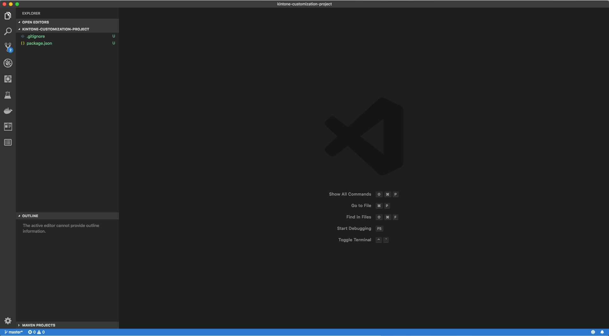
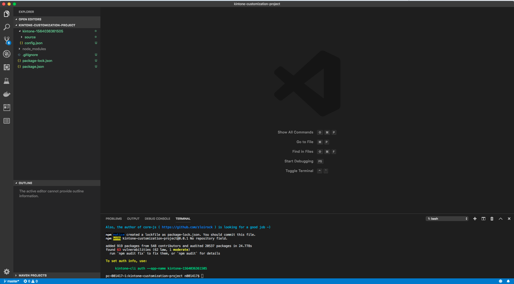
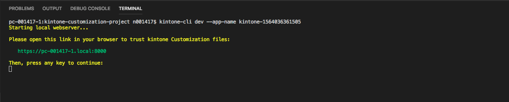
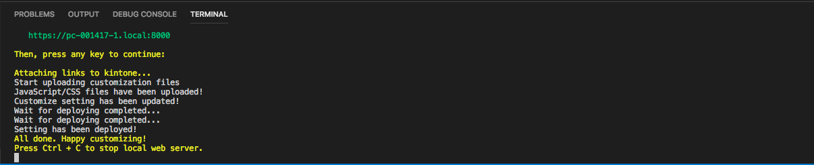
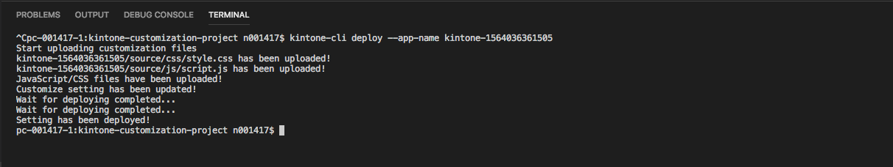

# Quickstart

This guide will help you create a minimum customization project for kintone with Kintone CLI

## 1. Initialize Project
``
kintone-cli init --quick
``

This will create a minimum project for kintone.



To use `@kintone/kintone-ui-component` or `@kintone/kintone-js-sdk`:

```
npm install @kintone/kintone-ui-component

// or

npm install @kintone/kintone-js-sdk
```

## 2. Create customization template
``
kintone-cli create-template --quick
``

This will create an ES5, customization app in VanillaJS



## 3. Provide authentication data
```
kintone-cli auth
    [--app-name <appName>]
    [--domain <domain>]
    [--username <username>]
    [--password <password>]
    [--app-id <appID>]
```

This will create and auth.json file with the credentials provided


## 4. Start dev
``
kintone-cli dev --app-name <appName>
``

This command will first start a local web server and provide you a link to trust it in your browser



Then after trusting kintone files:



## 5. Deploy
``
kintone-cli deploy --app-name <appName>
``

This command will deploy your customization code to kintone using the authetication credentials in auth.json

